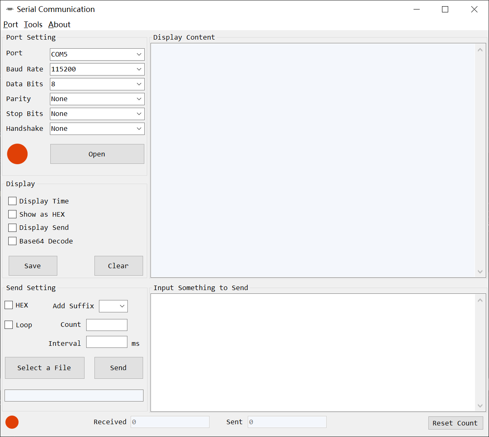
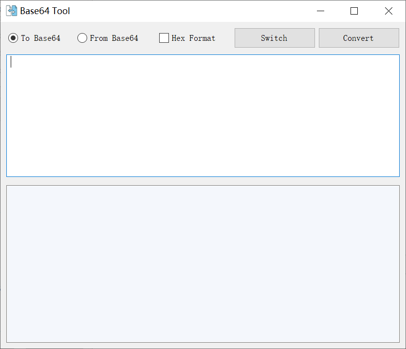
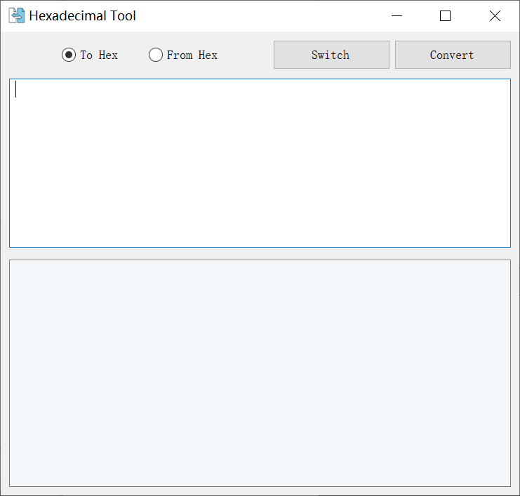

# MSCOM - Serial Communication Tool

**MSCOM** is an open-source C# tool designed for serial port communication on Windows. It supports sending and receiving data via serial ports and includes functionalities like hex conversion, base64 conversion, and logging capabilities.

You can download the release version here: [v1.0.0 Release](https://github.com/warmlab/mscom/releases/tag/v1.0.0).

## Features

- Real-time data monitoring from a serial port.
- Configurable serial settings such as baud rate, parity, data bits, stop bits, and handshake.
- Send data as a string, hex, or base64.
- Display received data in different formats, with time-stamps and conversion options.
- Save communication logs and reset sent/received counters.

## User Interface

### Main Serial Communication Tool
The main interface includes all the serial communication settings and the ability to send and receive data. The user can configure the port settings, control data display formats, and send hex or base64-encoded data:

### Base64 Tool
This tool allows you to easily convert data to and from Base64 format. The user interface for the Base64 tool looks like this:

### Hexadecimal Tool
This tool lets you convert data to and from hexadecimal format. Here’s the interface for hexadecimal conversions:

## Installation

1. Download the latest release from the [Releases Page](https://github.com/warmlab/mscom/releases/tag/v1.0.0).
2. Extract the files and run the executable.
3. You can modify the source code or compile it yourself using Visual Studio.
4. or Clone the repository:

    bash

    git clone https://github.com/warmlab/mscom.git

    Open the solution in Visual Studio.
    Build and run the project to start using the tool.

## usage
- Select a Serial Port: Choose a COM port from the available list.
- Configure Communication: Select the baud rate, data bits, stop bits, and parity using the dropdowns.
- Send Data: Enter the command or data to be sent and click the send button.
- Receive Data: Incoming data is automatically displayed in the receive text box.
- Hex Conversion: Use the included utility functions to convert strings to hex values and vice versa.

## Requirements

- .NET Framework 4.7.2 or higher
- Windows OS

## License

This project is licensed under the GPL-v3 License - see the [LICENSE](LICENSE) file for details.

## Contributing

Feel free to contribute by submitting issues or pull requests. Your contributions are welcome!
